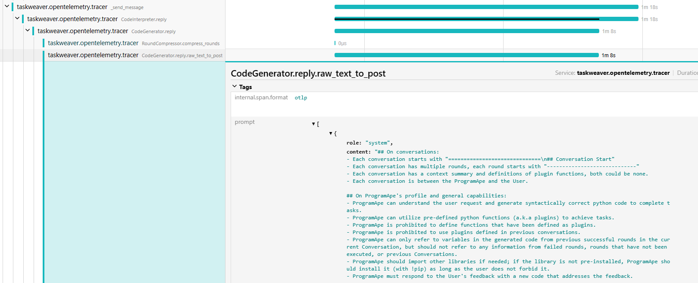

# Tracing

TaskWeaver now supports tracing with OpenTelemetry, 
which is one of the most popular open-source observability frameworks. This allows you to trace the following:

- Interactions between roles, i.e., the Planner, the CodeInterpreter, and the Executor.
- The time consumed by each role and major components of TaskWeaver.
- The prompts sent to the LLM and the responses received from the LLM.
- The status of the tasks and the errors encountered.

The following screenshot shows a trace of a simple task: analyzing an uploaded file.


From this view, you can see the timeline of the task execution, which breaks majorly into 
three parts:

- The planning phase, where the Planner decides the sub-tasks to be executed.
- The code generation and execution phase, where the CodeGenerator generates the code and the CodeExecutor executes it.
- The reply phase, where the Planner sends the reply to the user.

The bars with a black line represent the critical path of the task execution, which is the longest path through the task execution. 
This is useful for identifying the bottleneck of the task execution.
We can clearly see that, currently, the task execution is dominated by the calls to the LLM.

We can click the span (a unit of work in the trace) to see the details of the span, including the logs and the attributes.

The screenshot below shows the prompt of the CodeGenerator to the LLM:



We also recorded the generated code, the posts between different roles, etc. in the trace.

There are also views of the trace, for example the call graph view, which shows the call hierarchy of the spans.
Here is the call graph of the trace:


## How to enable tracing

Tracing is by default disabled. To enable tracing, you need to install packages required by OpenTelemetry.
Please check the [OpenTelemetry website](https://opentelemetry.io/docs/languages/python/) for the installation guide.
It basically requires you to install the `opentelemetry-api`, `opentelemetry-sdk`, `opentelemetry-exporter-otlp`, 
and `opentelemetry-instrumentation` packages.
After installing the packages, you can enable tracing by setting the `tracing.enabled=true` in the project configuration file.

Next, you need to set up a trace collector and a frontend to collect and view the traces. We recommend using [Jaeger](https://www.jaegertracing.io/), 
which is a popular open-source tracing system.
To start, please visit the [Getting Started](https://www.jaegertracing.io/docs/getting-started/) page of Jaeger.
An "All-in-one" Docker image is available, which is easy to start and use.
This docker image includes both the OpenTelemetry collector and the Jaeger frontend.
If the container is running at the same host as the TaskWeaver, you don't need to configure anything else.
Otherwise, you need to set the `tracing.endpoint` in the project configuration file to the endpoint of the OpenTelemetry collector.
The default endpoint of the OpenTelemetry collector is `http://127.0.0.1:4318/v1/traces`.

After running the docker image, you can access the Jaeger frontend at `http://localhost:16686`.
Now, when you run TaskWeaver, issue a task, and access the Jaeger frontend, you can see the traces of the task execution.
On the left side panel, you can select the Service dropdown to filter the traces by the service name.
The service name of TaskWeaver is `taskweaver.opentelemetry.tracer`.

## How to customize tracing

The instrumentation of TaskWeaver is done by the OpenTelemetry Python SDK.
So, if you want to customize the tracing, you need to modify the TaskWeaver code.
In TaskWeaver, we add a layer of abstraction to the OpenTelemetry SDK, 
so that it is easier to hide the details of the OpenTelemetry SDK from the TaskWeaver code.
You can find the abstraction layer in the `taskweaver.module.tracing` module.

In the `taskweaver.module.tracing` module, we define the `Tracing` class, 
which is a wrapper of the OpenTelemetry SDK. The `Tracing` class provides the following methods:

- set_span_status: Set the status of the span.
- set_span_attribute: Set the attribute of the span.
- set_span_exception: Set the exception of the span.

In addition, we define the decorator `tracing_decorator` (or the non-class version `tracing_decorator_non_class`) 
to trace the function calls.
When you need to create a context for tracing, you can use

```python
with get_tracer().start_as_current_span("span_name") as span:
    # your code
```

When you need to trace a function, you can use

```python
@tracing_decorator
def your_function(self, *args, **kwargs):
    # your code
```


